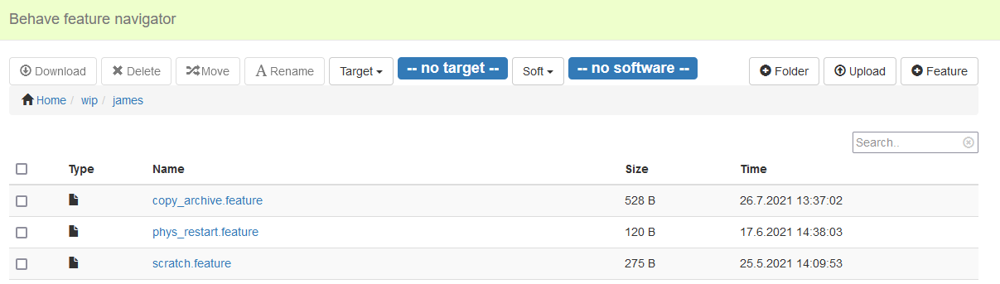

# Intro
This is a modified version of [node-file-manager](https://github.com/efeiefei/node-file-manager) with integrations for working with [behave-gui](https://github.com/behave-contrib/behave-gui).
# Screen Shot


# Config
To fill the `target` and `sw` dropdown lists, this fork of [node-file-manager](https://github.com/efeiefei/node-file-manager) looks for three folders under the served Behave root directory (the one specified with the `-d` argument, see 'Usage', below). So, under for example C:\\Users\\user\\git\\behave_home_dir\\features, we should ensure the following folders are present:
```
api/config/machines
api/config/machines/project

api/config/setups
```
The 2 `machines` folders fill the `Target`dropdown, while the `setups` folder fills the `Soft` dropdown.

# Usage

```sh
  git clone https://github.com/fallwest/node-file-manager.git
  cd node-file-manager
  npm i
  node ./lib/index.js -p 8092 -d C:\\Users\\user\\git\\behave_home_dir\\features
```

Then, we can view localhost:8092/ in our browser.
